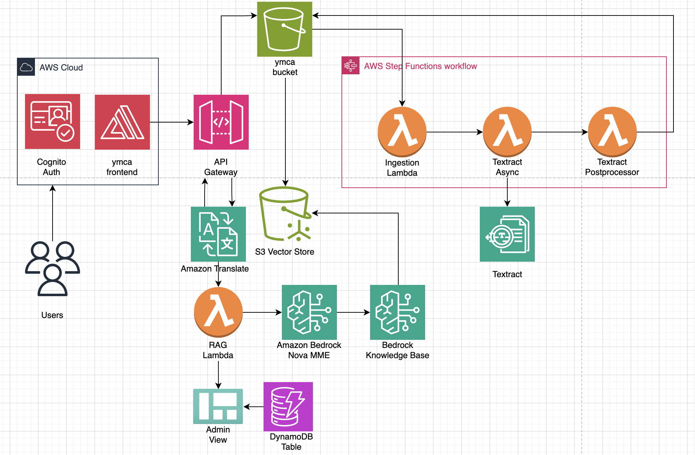

# YMCA AI Multilingual Chatbot

An intelligent document processing and multilingual chatbot system designed for YMCA organizations. This AI-powered solution processes historical documents, extracts knowledge, and provides multilingual chat support to help YMCA staff and members access information efficiently across language barriers.

---

## Visual Demo


> **Architecture Overview**: The system uses AWS serverless architecture with Step Functions orchestrating document processing, Textract for OCR, Bedrock for AI capabilities, and a React frontend for user interaction.

---

## Table of Contents

| Index                                               | Description                                              |
| :-------------------------------------------------- | :------------------------------------------------------- |
| [High Level Architecture](#high-level-architecture) | High level overview illustrating component interactions  |
| [Deployment Guide](#deployment-guide)               | How to deploy the project                                |
| [User Guide](#user-guide)                           | End-user instructions and walkthrough                    |
| [API Documentation](#api-documentation)             | Documentation on the APIs the project uses               |
| [Directories](#directories)                         | General project directory structure                      |
| [Modification Guide](#modification-guide)           | Guide for developers extending the project               |
| [Credits](#credits)                                 | Contributors and acknowledgments                         |
| [License](#license)                                 | License information                                      |

---

## High Level Architecture

The YMCA AI system leverages AWS serverless architecture to create a scalable, multilingual document processing and chatbot solution. The system automatically processes uploaded documents through OCR, extracts knowledge using AI, and provides intelligent chat responses in multiple languages.

Key components include document ingestion via S3, automated processing through Step Functions and Textract, knowledge storage in Bedrock Knowledge Base, and a React-based frontend for user interaction.



**Architecture Flow:**
1. **Document Upload** → Users upload historical documents via the web interface
2. **Document Processing** → Step Functions orchestrates OCR extraction via Textract
3. **Knowledge Extraction** → Processed text is stored in Bedrock Knowledge Base
4. **Multilingual Chat** → Users interact with the AI agent through Amazon Translate
5. **Response Generation** → RAG system provides contextual answers from processed documents

For a detailed explanation of the architecture, see the [Architecture Deep Dive](./docs/architectureDeepDive.md).

---

## Deployment Guide

For complete deployment instructions, see the [Deployment Guide](./docs/deploymentGuide.md).

**Quick Start:**
1. **Prerequisites**: Install Node.js 18+, AWS CLI, and AWS CDK CLI (`npm install -g aws-cdk`)
2. **Setup**: Clone repository, run `npm install` in both backend/ and frontend/ directories
3. **Deploy**: Configure AWS credentials, run `npm run bootstrap` then `npm run deploy` in backend/

---

## User Guide

For detailed usage instructions with screenshots, see the [User Guide](./docs/userGuide.md).

---

## API Documentation

For complete API reference, see the [API Documentation](./docs/APIDoc.md).

---

## Modification Guide

For developers looking to extend or modify this project, see the [Modification Guide](./docs/modificationGuide.md).

---

## Directories

```
├── backend/
│   ├── bin/
│   │   └── backend.ts
│   ├── lambda/
│   │   ├── batch-processor/
│   │   ├── textract-async/
│   │   └── textract-postprocessor/
│   ├── lib/
│   │   └── backend-stack.ts
│   ├── scripts/
│   │   ├── deploy.sh
│   │   └── destroy.sh
│   ├── test/
│   │   └── backend.test.ts
│   ├── cdk.json
│   ├── package.json
│   └── tsconfig.json
├── frontend/
│   ├── app/
│   │   ├── layout.tsx
│   │   ├── page.tsx
│   │   └── globals.css
│   ├── public/
│   │   └── [static assets]
│   ├── package.json
│   └── next.config.ts
├── docs/
│   ├── architectureDeepDive.md
│   ├── deploymentGuide.md
│   ├── userGuide.md
│   ├── APIDoc.md
│   ├── modificationGuide.md
│   └── media/
│       └── ymca_architecture.png
├── LICENSE
├── package-lock.json
└── README.md
```

### Directory Explanations:

1. **backend/** - Contains all backend infrastructure and serverless functions
   - `bin/` - CDK app entry point and configuration
   - `lambda/` - AWS Lambda function implementations for document processing
     - `batch-processor/` - Initiates document processing workflows
     - `textract-async/` - Starts OCR jobs for document text extraction
     - `textract-postprocessor/` - Processes OCR results for knowledge base
   - `lib/` - CDK stack definitions and infrastructure as code
   - `scripts/` - Deployment and management scripts
   - `test/` - Unit tests for backend components

2. **frontend/** - Next.js frontend application
   - `app/` - Next.js App Router pages and layouts
   - `public/` - Static assets (images, icons, etc.)

3. **docs/** - Project documentation and architecture diagrams
   - `media/` - Images, diagrams, and visual documentation

---

## Credits

This application was developed by:

- <a href="[INSERT_LINKEDIN_URL]" target="_blank">[INSERT_CONTRIBUTOR_NAME_1]</a>
- <a href="[INSERT_LINKEDIN_URL]" target="_blank">[INSERT_CONTRIBUTOR_NAME_2]</a>
- <a href="[INSERT_LINKEDIN_URL]" target="_blank">[INSERT_CONTRIBUTOR_NAME_3]</a>

[INSERT_ADDITIONAL_ACKNOWLEDGMENTS - Teams, supporters, or organizations to acknowledge]

---

## License

This project is licensed under the MIT License - see the [LICENSE](./LICENSE) file for details.

