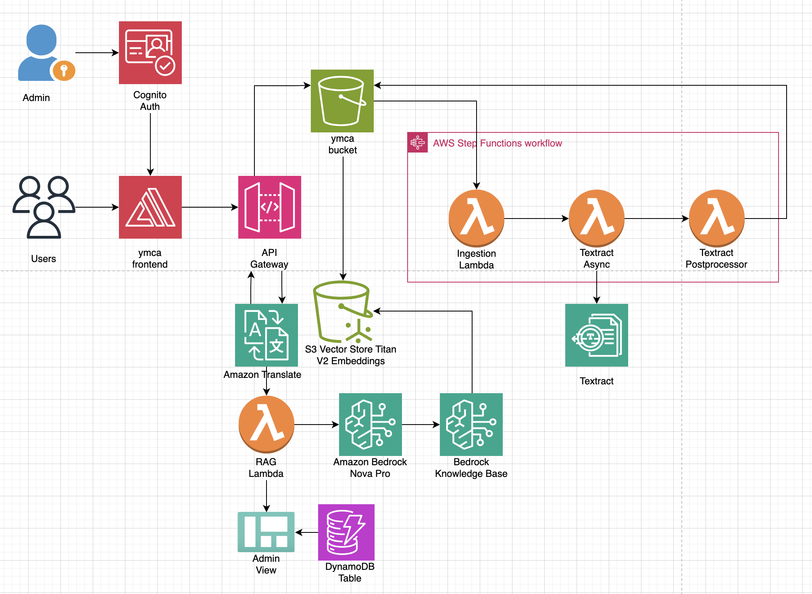

# YMCA AI Multilingual Chatbot

An intelligent document processing and multilingual chatbot system designed for YMCA organizations. This AI-powered solution processes historical documents, extracts knowledge, and provides multilingual chat support to help YMCA staff and members access information efficiently across language barriers.

---

## Visual Demo


> **Architecture Overview**: The system uses AWS serverless architecture with Step Functions orchestrating document processing, Textract for OCR, Bedrock Knowledge Base for RAG, and a Next.js frontend deployed via Amplify.

---

## Table of Contents

| Index                                               | Description                                              |
| :-------------------------------------------------- | :------------------------------------------------------- |
| [Features](#features)                               | Key features and capabilities                            |
| [High Level Architecture](#high-level-architecture) | High level overview illustrating component interactions  |
| [Deployment Guide](#deployment-guide)               | How to deploy the project                                |
| [User Guide](#user-guide)                           | End-user instructions and walkthrough                    |
| [API Documentation](#api-documentation)             | Documentation on the APIs the project uses               |
| [Directories](#directories)                         | General project directory structure                      |
| [Modification Guide](#modification-guide)           | Guide for developers extending the project               |
| [Credits](#credits)                                 | Contributors and acknowledgments                         |
| [License](#license)                                 | License information                                      |

---

## Features

### Multi-Language Support
- **12 Languages Supported**: English, Spanish, French, German, Italian, Portuguese, Chinese, Japanese, Korean, Arabic, Hindi, Russian
- **Automatic Translation**: Amazon Translate provides seamless language detection and bidirectional translation
- **Language Preservation**: Conversation context maintained across language switches

### Intelligent AI Chat
- **RAG-Powered Responses**: Bedrock Knowledge Base retrieves relevant context from uploaded documents
- **Amazon Nova Pro**: Advanced AI model for generating contextual, citation-backed responses
- **Streaming Support**: Real-time token-by-token response delivery for immediate feedback
- **Source Citations**: Every response includes downloadable source documents with pre-signed URLs

### Document Processing
- **Automated Pipeline**: Step Functions orchestrates end-to-end document processing
- **OCR Extraction**: Amazon Textract extracts text, tables, and forms from PDFs 
- **Smart Indexing**: Bedrock Knowledge Base automatically indexes processed documents
- **Multi-Format Support**: PDF, PNG, JPG, JPEG, TIFF files

### Analytics & Admin Dashboard
- **Conversation Tracking**: DynamoDB stores all chat interactions and metadata
- **Usage Analytics**: Track queries, languages, popular topics, and response times
- **Document Management**: Admin interface for uploading and managing knowledge base content
- **Cognito Authentication**: Secure admin access with email/password authentication

### Performance & Scalability
- **S3 Vectors**: Cost-effective vector storage
- **Lambda Function URLs**: Native streaming support with 15-minute timeout
---

## High Level Architecture

The YMCA AI system leverages AWS serverless architecture to create a scalable, multilingual document processing and chatbot solution. The system automatically processes uploaded documents through OCR, extracts knowledge using AI, and provides intelligent chat responses in multiple languages.



### Architecture Flow:

1. **Document Upload** → Users upload historical documents via the admin panel to S3 `input/` folder
2. **Event Trigger** → S3 event notification triggers batch processor Lambda function
3. **Document Processing** → Step Functions orchestrates OCR extraction via Amazon Textract
4. **Text Storage** → Processed text is saved to S3 `output/processed-text/` folder in structured JSON format
5. **Knowledge Base Ingestion** → Bedrock Knowledge Base automatically reads from `output/` folder and creates embeddings
6. **Vector Storage** → Embeddings stored in S3 Vectors (managed by `cdk-s3-vectors` library)
7. **Multilingual Chat** → Users interact with the chatbot through the Next.js frontend
8. **Query Translation** → Amazon Translate converts queries to English for optimal retrieval
9. **RAG Retrieval** → Bedrock Knowledge Base searches vector index for relevant context
10. **Response Generation** → Amazon Nova Pro generates contextual answers with citations
11. **Response Translation** → Amazon Translate converts responses back to user's language
12. **Streaming Delivery** → Responses delivered in real-time via Lambda Function URL

For a detailed explanation of the architecture, see the [Architecture Deep Dive](./docs/architectureDeepDive.md).

---

## Deployment Guide

Deploy the complete YMCA AI Chatbot with automated infrastructure provisioning.

### Quick Start

```bash
# Clone the repository
git clone https://github.com/ASUCICREPO/YMCA_snoco_Chatbot.git
cd YMCA_snoco_Chatbot

# Make deployment script executable
chmod +x deploy.sh

# Run automated deployment
./deploy.sh
```

### What Gets Deployed

The `deploy.sh` script automatically provisions:

1. ✅ **Backend Infrastructure** (via AWS CDK)
   - Lambda functions with Function URLs (chat, document processing)
   - Step Functions workflow
   - Bedrock Knowledge Base with S3 Vectors
   - DynamoDB tables (conversations, analytics)
   - Cognito User Pool and Identity Pool

2. ✅ **Frontend Application** (via AWS Amplify)
   - Next.js app deployed from GitHub
   - Automatic environment variable injection
   - CI/CD pipeline for future updates

3. ✅ **Admin User Setup**
   - Cognito user created with provided credentials
   - Immediate access to admin dashboard

### Prerequisites

- **AWS Account** with appropriate permissions
- **AWS CLI** configured (`aws configure`)
- **Node.js** 18+ installed
- **AWS CDK** CLI installed (`npm install -g aws-cdk`)
- **GitHub Personal Access Token** (for Amplify deployment)
- **Bedrock Model Access** (Amazon Nova Pro, Titan Embeddings V2)

### Deployment Time

- **Backend**: 10-15 minutes
- **Frontend**: 3-5 minutes (Amplify build)
- **Total**: ~15-20 minutes

### Post-Deployment

After successful deployment, you'll receive:
- Frontend URL (Amplify App)
- Streaming Function URL
- Cognito User Pool IDs
- S3 bucket names

**📚 For detailed deployment instructions, see the [Deployment Guide](./docs/deploymentGuide.md).**

---

## Cleanup

Remove all deployed resources with the cleanup script:

```bash
# Make cleanup script executable
chmod +x cleanup.sh

# Run interactive cleanup
./cleanup.sh
```

The script will:
- Prompt for confirmation before deleting resources
- Ask whether to delete S3 buckets and DynamoDB tables (RETAIN policy)
- Delete the CloudFormation stack and all associated resources
- Optionally clean up local build artifacts

**Note**: S3 buckets (documents, vectors) and DynamoDB tables have RETAIN policies and must be explicitly deleted.

---

## User Guide

### Accessing the Application

1. Navigate to the Amplify App URL (provided after deployment)
2. Select your preferred language from the globe icon
3. Start chatting or click a topic card to begin

### Using the Chat Interface

- **Ask Questions**: Type questions about YMCA history in any supported language
- **View Sources**: Click on citations to download original documents
- **Continue Conversations**: The AI maintains context across multiple messages
- **Switch Languages**: Change language mid-conversation without losing context

### Admin Features

1. **Login**: Navigate to `/admin` and use your Cognito credentials
2. **Upload Documents**: Use the admin page upload feature to add PDFs to expand the knowledge base
   - Documents are uploaded to S3 `input/` folder
   - Textract automatically processes and extracts text
   - **Verify Processing**: Check S3 bucket `output/processed-text/` folder to confirm files are populated (processing complete)
3. **Sync Knowledge Base**: After processing completes, navigate to AWS Bedrock Console → Knowledge Bases → `ymca-knowledge-base` → Data Sources → `ymca-s3-documents` → Click **"Sync"** to make documents queryable
4. **View Analytics**: Track usage, popular topics, and conversation metrics
5. **Monitor Processing**: Check document processing status in Step Functions

**📚 For detailed usage instructions with examples, see the [User Guide](./docs/userGuide.md).**

---

## API Documentation

The YMCA AI Chatbot provides RESTful APIs for conversational AI with multilingual support.

### Frontend Routes

The Next.js frontend provides the following application routes:

| Route | Description | Access |
|-------|-------------|--------|
| `/` | **Homepage** - Welcome screen with topic cards and language selector | Public |
| `/chat` | **Chat Interface** - Conversational AI experience with YMCA historical knowledge | Public |
| `/admin` | **Admin Dashboard** - Document upload, analytics, and system monitoring | Authenticated (Cognito) |

**Base Frontend URL**: `https://[AMPLIFY-APP-ID].amplifyapp.com/` (provided after deployment)

### Backend API Base URL
```
https://[API_ID].execute-api.[REGION].amazonaws.com/prod/
```

### Streaming Chat Endpoint (Recommended)

**Lambda Function URL** (Native streaming, 15-min timeout):
```
POST https://[FUNCTION_URL]/
```

**Request**:
```json
{
  "message": "What was the YMCA's role in World War II?",
  "conversationId": "conv-123",
  "language": "en"
}
```

**Response** (Server-Sent Events):
```
data: {"type":"chunk","content":"The YMCA"}

data: {"type":"chunk","content":" played a vital role..."}

data: {"type":"complete","response":{...full response with citations...}}

data: [DONE]
```

### Key Features
- **Multi-language Support**: 12 languages with auto-detection
- **Streaming Responses**: Real-time token-by-token delivery
- **Source Citations**: Every response includes downloadable documents
- **Context Preservation**: Conversation history maintained

**📚 For complete API reference with examples, see the [API Documentation](./docs/APIDoc.md).**

---

## Modification Guide

Extend and customize the YMCA AI Chatbot for your needs.

### Common Modifications

**1. Add New Page**
```typescript
// frontend/app/about/page.tsx
export default function AboutPage() {
  return <div>Your content</div>;
}
```

**2. Modify AI Prompts**
```javascript
// backend/lambda/agent-proxy/index.js
function createEnhancedPrompt(context, query) {
  return `You are a friendly YMCA historian...`;
}
```

**3. Switch Bedrock Models**
```javascript
// backend/lambda/agent-proxy/index.js
modelId: 'anthropic.claude-3-sonnet-20240229-v1:0'
```

**📚 For comprehensive modification examples, see the [Modification Guide](./docs/modificationGuide.md).**

---

## Directories

```
YMCA_Scono_chatbot/
├── backend/
│   ├── bin/                          # CDK app entry point
│   ├── lambda/
│   │   ├── agent-proxy/              # RAG-powered chat with streaming
│   │   ├── batch-processor/          # S3 upload event handler
│   │   ├── textract-async/           # Textract job initiator
│   │   ├── check-textract-status/    # Job status poller
│   │   ├── textract-postprocessor/   # OCR result processor
│   ├── lib/                          # CDK stack definitions
│   ├── test/                         # Unit tests
│   ├── cdk.json                      # CDK configuration
│   ├── package.json                  # Backend dependencies
│   └── tsconfig.json                 # TypeScript config
├── frontend/
│   ├── app/
│   │   ├── page.tsx                  # Homepage/welcome screen
│   │   ├── layout.tsx                # Root layout
│   │   ├── globals.css               # Global styles
│   │   ├── admin/                    # Admin dashboard
│   │   ├── chat/                     # Chat interface
│   │   ├── components/               # Page-level components
│   │   ├── context/                  # React context providers
│   │   └── hooks/                    # Custom React hooks
│   ├── components/                   # Shared/reusable components
│   ├── lib/                          # API services, i18n, utilities
│   ├── public/                       # Static assets
│   ├── types/                        # TypeScript type definitions
│   ├── next.config.js                # Next.js configuration
│   └── package.json                  # Frontend dependencies
├── docs/
│   ├── APIDoc.md                     # API reference
│   ├── architectureDeepDive.md       # System architecture details
│   ├── deploymentGuide.md            # Deployment instructions
│   ├── modificationGuide.md          # Customization guide
│   ├── streamingIntegration.md       # Streaming implementation
│   ├── userGuide.md                  # End-user documentation
│   └── media/                        # Diagrams and screenshots
├── deploy.sh                         # Automated deployment script
├── cleanup.sh                        # Resource cleanup script
├── amplify.yml                       # Amplify build configuration
├── claude.md                         # Development guidelines
└── README.md                         # Project overview
```

---

## Additional Resources

**Documentation**: Comprehensive guides available in the `docs/` folder:
- [Architecture Deep Dive](./docs/architectureDeepDive.md) - System design, AWS services, security
- [Deployment Guide](./docs/deploymentGuide.md) - Setup instructions and troubleshooting
- [User Guide](./docs/userGuide.md) - Admin features and usage examples
- [API Documentation](./docs/APIDoc.md) - Endpoint reference with examples
- [Modification Guide](./docs/modificationGuide.md) - Customization instructions
- [Streaming Integration](./docs/streamingIntegration.md) - Real-time response implementation

**Tech Stack**:
- **Frontend**: Next.js 16, React 19, TypeScript, Tailwind CSS v4, AWS Amplify
- **Backend**: AWS Lambda (Node.js 20.x), Amazon Bedrock (Nova Pro, Titan Embeddings V2), Textract, Translate, Step Functions, S3, DynamoDB, Cognito
- **Infrastructure**: AWS CDK (TypeScript)

**Credits**: Developed by ASU Cloud Innovation Center ([Aarav Matalia](https://www.linkedin.com/in/aarav-matalia/), [Ashik Mathew Tharakan](https://www.linkedin.com/in/ashik-tharakan/)) in collaboration with YMCA of Snohomish County.

**License**: MIT License - see [LICENSE](./LICENSE) file

---

**Built with ❤️ by the ASU CIC team**
